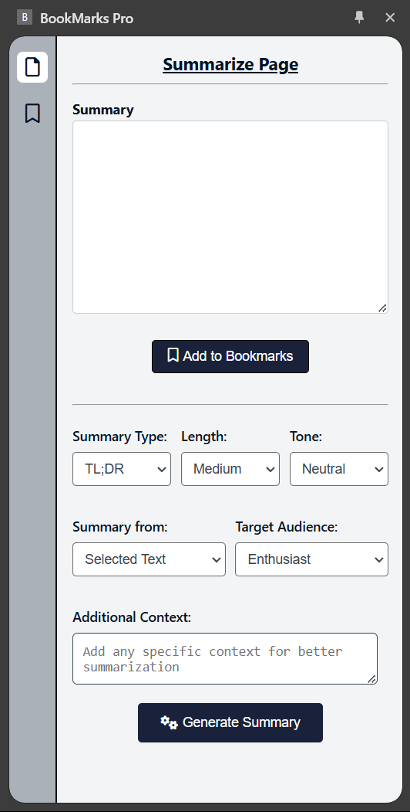
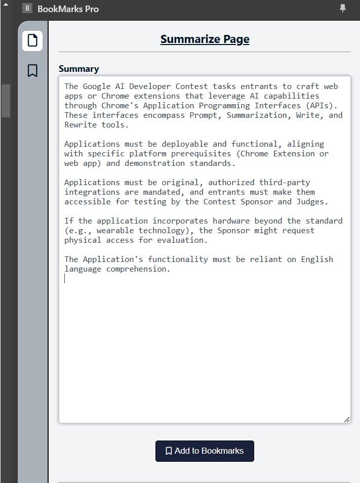
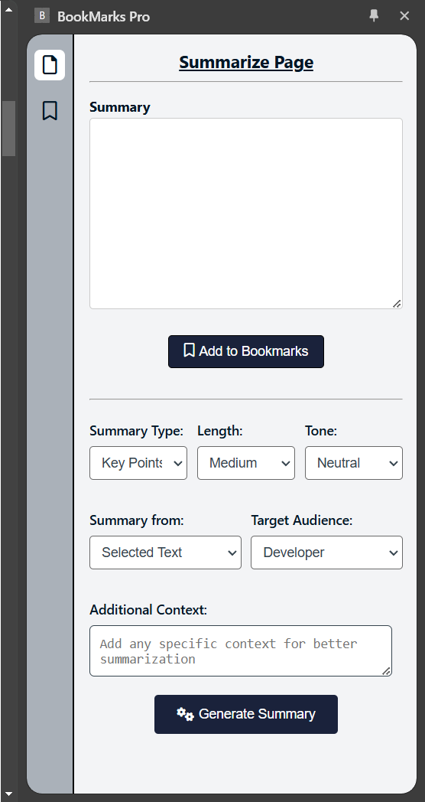
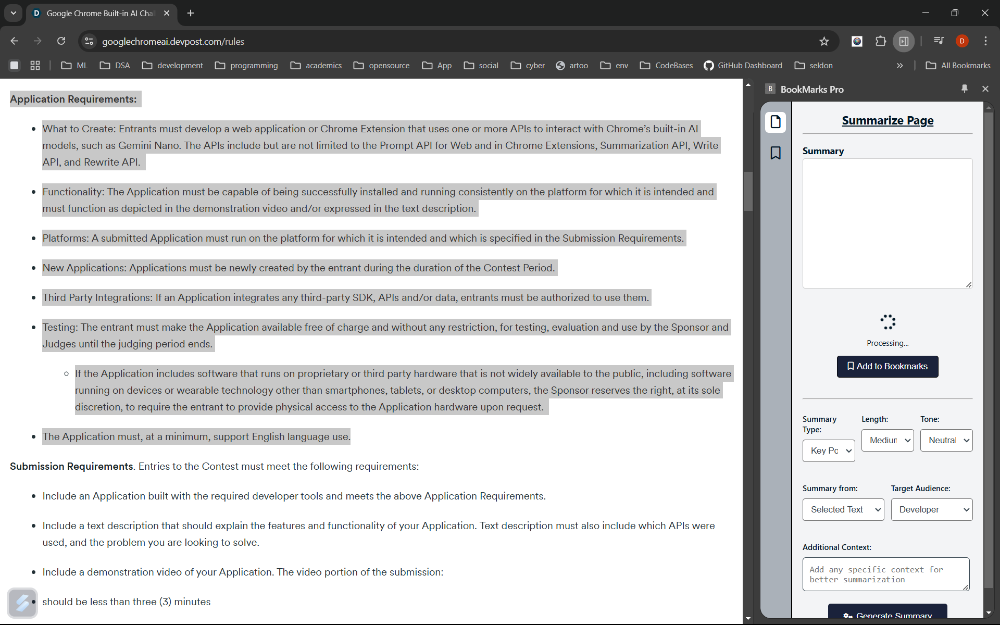
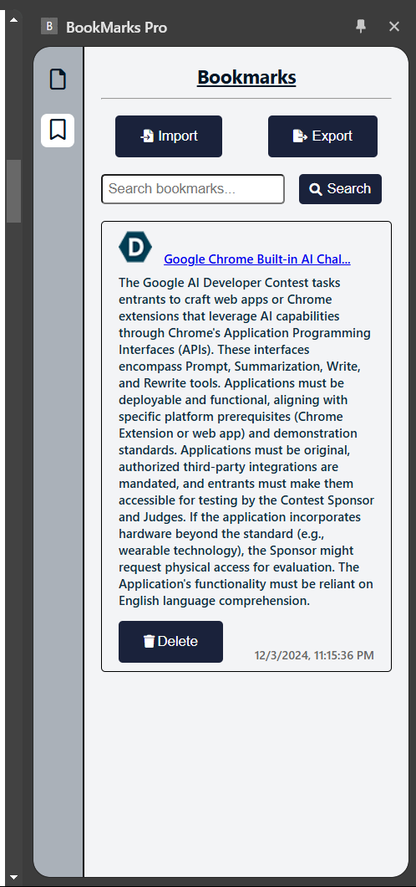

## <b><u>Bookmarks PRO</u></b>- <i>Smarter Bookmarks for a Smarter You!</i>

### Running this extension

1. Clone this repository
2. Run `npm install` in this folder to install all dependencies.
3. Run `npm run build` to build the extension.
4. Load the newly created `dist` directory in Chrome as an [unpacked extension](https://developer.chrome.com/docs/extensions/get-started/tutorial/hello-world#load-unpacked).

### How to Use
1. Click the extension icon to open the summary side panel.
2. Select text on a page and other options and click on the generate summary button to get the summary. 
3. Click on add bookmark button to save the summary as a bookmark.
4. Click on the bookmark icon to view the saved bookmarks.

### Overview

Uses Chrome build in AI summariser and  rewriter API for summarising the page content, either selected text or the whole page. The summary is displayed in a side panel. And also provides an option to edit the summary and save as a Bookmark. 

<!--  -->

